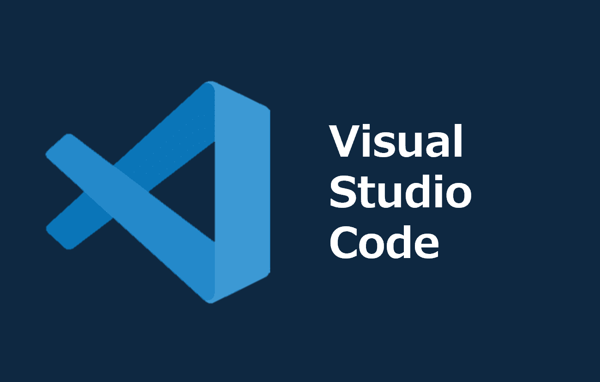

===============================================================================
[実践]AWSでの開発環境構築：IaCでサーバー構築+最小権限IAM+VSCode Remote SSHを設定
===============================================================================

* `こちらの記事 <>`_ の環境デプロイ用コードを格納しています
* 「 `CDK ~Typescript~ <./code/cdk-app>`_ 」「 `CloudFormation ~yaml~ <./code/cfn>`_ 」「 `Terraform <./code/tf>`_ 」用意してますのでお好みで試してみてください
